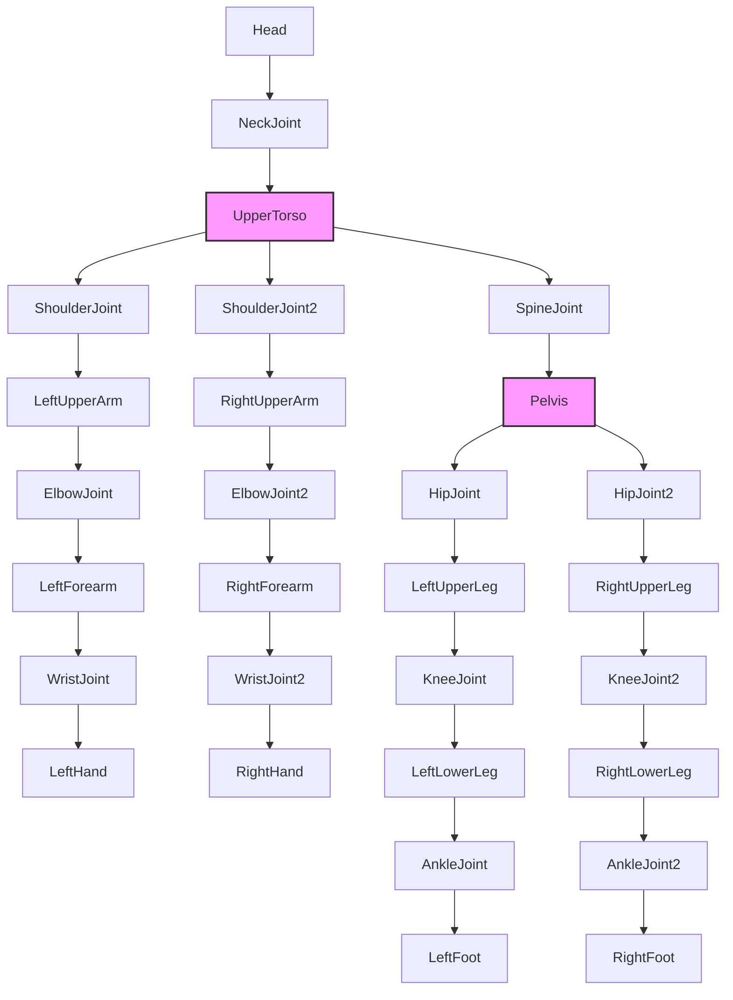

# Executive Summary

BombSquad’s physics is built on the open-source **Ballistica** engine (formerly “BombSquad”) which uses the **ODE** rigid-body library for dynamics.  In-game characters are full ragdolls (≈12 linked rigid pieces) and props use simple colliders.  Each physics update fixes a time‐step and employs ODE’s iterative contact-solver (QuickStep or LCP) to resolve forces.  Collisions use impulse-based response with standard restitution and Coulomb-friction models.  Joint constraints (ball-and-socket, hinge, etc.) can be tuned via ODE’s ERP/CFM spring-damper formulation.  We analyze BombSquad’s physics architecture, ragdoll joint setup, typical in-game interactions, and supply the core formulas and pseudocode for impulses and joint forces.  Finally, we give parameter tuning guidelines (typical ranges and test methods), highlight pitfalls (numerical instability, tunneling, etc.), and compare relevant engine features in tables.

# BombSquad Physics Architecture

Ballistica/BombSquad uses **ODE (Open Dynamics Engine)** for its 3D rigid-body physics.  The simulation runs at a fixed time-step (e.g. 50–60 Hz), integrating forces and solving constraints each step.  ODE models **rigid bodies** with arbitrary mass/inertia and supports many joint types: ball-and-socket, hinge (revolute), slider (prismatic), hinge2, fixed (weld), universal, and motors.  Collision shapes include spheres, boxes, cylinders, capsules, planes and triangle meshes, and bodies are placed in **collision spaces** (quad-tree or hash) for broad-phase checks.  

Before each step ODE performs **collision detection**, generating contact points with normals and penetration depths.  For each contact, a special contact joint is created with parameters (friction coefficient μ, restitution *e*, etc.).  All contacts are grouped then fed to the solver.  The simulation uses a Lagrange-multiplier approach: either the “big matrix” direct solve or the iterative *QuickStep* solver.  By default QuickStep runs a configurable number of iterations (for accuracy).  World parameters include gravity (settable per world), global damping scales (linear & angular) and max speeds.  ODE applies **damping** by scaling velocities each step: *v<sub>new</sub> = v<sub>old</sub>*(1 – scale) if above threshold.  Restitution and friction follow standard impulse rules: impulses are applied at contacts along the normal with magnitude based on relative normal velocity and *e*.  Friction implements a Coulomb “friction cone” (|F<sub>T</sub>| ≤ μ·|F<sub>N</sub>|).  

In BombSquad’s code, each **spaz character** has an associated “node” in the scene graph representing the ragdoll, with physics bodies connected by joints.  For example, a `PlayerSpaz` Python object links the ragdoll’s torso position to the player’s representation.  Scene graph nodes carry transforms and geometry (hitboxes) driven by the physics bodies.  Damage/hits are delivered via high-level messages, but the physics ultimately uses ODE’s collision/contact system.  Collision filtering (layers/masks) is likely used (for example, to have characters collide with terrain but not certain triggers), though specific settings aren’t documented publicly.

# Ragdoll Implementation

BombSquad’s characters are **fully dynamic ragdolls**.  Early dev logs confirm the old simpler two-sphere model was replaced by a ~12-piece ragdoll.  Likely segments include head, upper torso, lower torso/pelvis, upper/lower arms, hands, upper/lower legs, feet (see diagram below).  Each segment is a rigid body (e.g. capsule or cylinder colliders) with appropriate mass.  Joints connect them with realistic limits: shoulders and hips use ball-socket joints (3 DOF), elbows and knees use hinge joints (1 DOF) so legs/arms bend only backward, etc.  Joint limits and *optional* springiness can be set via ODE’s parameters (ERP/CFM): for a desired “spring constant” *k<sub>p</sub>* and damping *k<sub>d</sub>*, set ERP= *h·k<sub>p</sub>/(h·k<sub>p</sub>+k<sub>d</sub>)* and CFM= *1/(h·k<sub>p</sub>+k<sub>d</sub>)*.  In practice a small spring force may be applied to keep limbs from infinitely flopping.  Mass distribution is skewed to make characters stable: torsos are heaviest, limbs lighter.

Each ragdoll segment has a collision shape, probably **capsules or convex shapes** to avoid snagging on geometry.  When limbs swing and collide (or get hit by objects), impulses are automatically computed.  The hitboxes used for “damage” may map to body parts (e.g. head sphere), but that is a game-layer detail on top of the physics bodies.



*Figure: Simplified ragdoll bone hierarchy. Key joints (shoulders, elbows, hips, knees) have physical limits. (Head/neck and wrist/ankle joints omitted for brevity.)*

# Gameplay Collision Scenarios

In normal gameplay, most collisions follow rigid-body impulse physics.  For example, **player–player collisions** act like equal‐mass spheres: if both run into each other, momentum exchange depends on their velocities and the restitution coefficient.  If two players of mass *m* collide head-on with speeds *v* and zero friction, they essentially exchange velocities (for *e*≈1) – one goes forward, the other back – conserving momentum.  **Player–object hits** (e.g. punching a box or hockey puck) similarly impart impulse: the impulse magnitude *j* at a contact is  
> *j = –(1+e) (v_rel·n) / (1/m₁ + 1/m₂)*,  
where *v_rel* is relative velocity along normal *n*. The objects then have updated velocities *v₁′ = v₁ + (j/m₁)*n* and *v₂′ = v₂ – (j/m₂)*n*.  

**Bomb explosions** apply radial impulses: in the engine this may be implemented via adding forces/impulses to nearby bodies (not pure ODE collision).  In effect, each body within blast range receives a sudden impulse outward.  The resulting motion obeys momentum: lighter bodies fling farther.  **Terrain collisions** (floor, walls) use contact normals; a falling player bounces with restitution *e* (game maps often use wood/clay materials).  **Object–object** hits (like bouncing a ball or block) follow the same rules: a heavier stationary object imparts less recoil to the attacker, etc.  

In all cases we expect post-collision velocities by the impulse formula, plus some tangential friction.  If two surfaces slide, a friction impulse ≤ μ·N develops (with μ set per material; higher μ means “stickier” surfaces).  For example, sliding a player along a wall will decelerate according to µ and normal force.  

*Expected outcomes:* Colliding bodies exchange momentum in line with their masses and *e*.  A very elastic setting (*e*≈1) makes bounces strong (almost total energy conservation); low *e* causes objects to “stick” or stop (inelastic).  Friction reduces sliding speed: higher μ makes bodies halt sooner.  If a ragdoll’s foot hits a wall while running, the friction cone |F<sub>T</sub>|≤μ|F<sub>N</sub>| will generate tangential impulses up to μ times the normal, causing the body to slow or grip.  

# Physics Equations and Pseudocode

**Linear impulse response:** For two colliding bodies A,B with masses *m_A, m_B*, pre-collision velocities *v_A, v_B*, contact normal *n* (pointing from B to A), and restitution *e*, the collision impulse *j* is computed as: 

```
v_rel = (v_A - v_B) · n
if v_rel < 0:  # bodies moving toward each other
    j = -(1 + e) * v_rel / (1/m_A + 1/m_B)
    # Apply impulse along normal:
    v_A' = v_A + ( j / m_A) * n
    v_B' = v_B - ( j / m_B) * n
```

This formula (from conservation of momentum plus restitution) ensures relative post-collision speed = –*e* times pre-collision.  For stationary B, this simplifies to *j = -(1+e) m_A v_rel* (if m_B → ∞).  (See e.g..)

**Friction (Coulomb model):** At a contact with normal force *F<sub>N</sub>* and tangential relative velocity, the frictional impulse *F<sub>T</sub>* satisfies 

<div align="center">|F<sub>T</sub>| ≤ μ · |F<sub>N</sub>|</div>

i.e. limiting friction is μ times normal force.  In practice, ODE approximates this via tangential constraints forming a friction “pyramid”.

**Joint spring-damper:** ODE models soft joints by ERP (error-reduction) and CFM (constraint force mixing).  Given desired spring constant *k_p* and damping *k_d*, set: 

<div align="center">ERP = h·k_p / (h·k_p + k_d),  &nbsp; CFM = 1/(h·k_p + k_d),</div>

where *h* = timestep.  This yields an implicit spring force *F = -k_p·x - k_d·ẋ* between joint bodies (keeping constraints “soft”).  In simple form, one can think of each joint applying <br>`F_spring = -k_p*(θ - θ_rest) - k_d*(ω_rel)`,<br>where θ is the hinge angle, ω_rel its angular velocity.  (ODE’s ERP/CFM automatically handle this under the hood.)

**Example pseudocode (collision & spring):**

```python
# Collision impulse (no rotation, two bodies):
if v_rel < 0:
    j = -(1 + e) * v_rel / (inv_massA + inv_massB)
    vA += (j * inv_massA) * n
    vB -= (j * inv_massB) * n

# Simple joint spring-damper (for one axis):
F_spring = -k_p * (angle - rest_angle)
F_damp   = -k_d * (angular_vel)
ApplyTorque(bodyA, +F_spring + F_damp)
ApplyTorque(bodyB, -(F_spring + F_damp))
```

Here *inv_mass = 1/m*, *n* is contact normal, and `ApplyTorque` applies equal/opposite torques.  For linear springs, replace angles with positions and torques with forces.  These equations mirror ODE’s internal operations.

# Tuning Parameters and Testing

Typical parameter ranges in BombSquad might be (heuristic): masses in 0.5–5.0 units (heavier bodies, lighter props); restitution *e* from 0 (no bounce) to ~0.8 (bouncy); friction μ around 0.1–1.0; damping scales small (linear/ang ≤ 0.1).  Since ODE damping scales apply as *v_new = v*(1–scale)* each step, a linear damping of 0.02 reduces velocity ~2%/step.  

**Tuning methodology:** Use simple test cases. For momentum/speed tuning, drop one object onto another with known masses and measure bounce velocities (confirm impulse formula).  For joint tuning, hinge a limb with springs and give it a shove, observing oscillation frequency vs. damping.  Automated scripts can step the physics and log parameters like peak velocities, settle times, energy loss, etc.  One can also compare against analytical predictions (e.g. energy conservation ratios).  Example test: collide two identical spheres with a known *e* and check post-collision speed matches theory (for *e=0.5* the normal component of relative velocity should reverse sign and halve).  

Parameter scans (e.g. sweeping restitution or damping) can be automated.  Measure outcomes like bounce height of a dropped mass (for restitution), or time-to-stop (for friction/damping).  Metrics: *post-collision speed*, *settling time*, *penetration depth*, etc.  Use visual aids (graphs, logs) or an in-engine “unit test” mode.  Since ODE is deterministic with fixed-step, consistent behavior aids such testing.  

Recommended **ranges** (order-of-magnitude) might be:
- *Mass*: characters ~1–5; small props ~0.1–1. 
- *Restitution e*: 0.0–1.0 (clay vs rubber); e.g. 0.4 for soft bodies, 0.8 for balls.  
- *Friction μ*: 0.0 (ice) to ~1.0 (rough). BombSquad likely uses moderate friction (terrain/clay).  
- *Damping scale*: 0–0.1 (above that, motion decays very quickly; 0.02 recommended for stability).  
- *ERP/CFM*: often ERP~0.2–0.5, CFM small (~0–0.001) for firm joints. Adjust to prevent joint oscillation.  

As a tuning method, introduce one change at a time and observe well-defined behaviors: e.g. adjust *e* until dropped characters bounce to a realistic height, tune friction until sliding stops in desired time, etc.  

# Pitfalls and Performance

- **Instability**: Large forces or very stiff constraints can cause the solver to fail (bodies jitter or “explode”).  ODE recommends small damping or force limits for stability.  For example, if two surfaces repeatedly collide at very high *e*, energy can accumulate.  Ensuring the global CFM (constraint softening) is nonzero can help stability.  Likewise, enabling *auto-disable* (sleep) for resting bodies reduces floating jitter.

- **Tunneling/CCD**: Very fast objects can skip over thin obstacles between steps.  BombSquad likely avoids extremely high speeds or uses continuous collision detection (e.g. ODE raycasts).  If objects tunnel, reduce timestep or use smaller collider geometry.

- **Joint limits**: If joints exceed limits due to impulses, ragdolls can contort unnaturally. Ensure hinge limits are enforced, possibly with slight restitution on limit impact.  ODE’s joint limit parameters (stop ERP/CFM) control bounce at joint limits.

- **Performance**: Many contact points or joints slow the simulation. BombSquad uses simple geometry, but crowded scenes (e.g. stacked crates) mean many collision tests.  ODE’s QuickStep scales roughly O(m·N) where m = contacts+constraints, N = iterations.  Limiting contact generation (fewer colliding points per object) and tuning iterations (≈4–10) balances speed vs accuracy.  Also, disabling collision between certain groups (e.g. ragdoll limbs with themselves) can save cost.

- **Client‐Server Sync**: In networked play, nondeterministic physics can desync. BombSquad’s synchronized ragdolls ensure bodies don’t “teleport” inconsistently (as noted by developers elsewhere).  Excessive springiness or random seeds in physics can break sync.

- **Edge Cases**: Thin geometry (wedges, sharp corners) can snag ragdoll capsules.  Float precision issues if world units are too large (Box2D notes [91†L178-L187] advise ~1–10 m scale).  High friction can create near-singular constraint systems; in ODE, increasing CFM or iterations can help.  Rotating bodies at very high speed can also cause solver errors unless “finite rotation” mode is enabled per-body.

# Comparison Tables

**Physics Engine Features:** For context, Table 1 compares ODE (used by BombSquad) with other common engines.  (Sources: ODE Manual, Box2D docs.)

| Feature                | **ODE (BombSquad)**   | **Bullet Physics**      | **Box2D**                 |
|:-----------------------|:---------------------|:-----------------------|:--------------------------|
| Dimension              | 3D                   | 3D                     | 2D                        |
| Rigid-body solver      | LCP (QuickStep/Gauss) | Sequential impulse (iterative) | Sequential Gauss-Seidel |
| Contact/Collision      | Hard contacts, LCP solver | Hard contacts (Jacobi/Sequential impulses) | Contact constraints, continuous CCD |
| Joint types            | Ball socket, Hinge, Slider, Hinge2, Universal, Fixed, Motors | Hinge, Point2Point, Slider, ConeTwist, SixDOF, etc. (many) | Revolute, Prismatic, Distance, Pulley, Gear, Wheel, Weld, Rope |
| Collision shapes       | Sphere, Box, Capsule, Cylinder, Plane, Tri-mesh | Sphere, Box, Capsule, Convex hull, Triangle mesh, Heightfield, etc. | Circle, Polygon, Chain, Edge (2D only) |
| Solver iterations      | Configurable (QuickStep iter.) | Configurable (default ~10–20) | Iterations usually 10–20 |
| License                | LGPL/BSD             | zlib (free)            | MIT (free)                |

**Key Parameter Effects:** Table 2 summarizes how adjusting common parameters affects behavior.

| Parameter                 | Typical Range         | Effect When Increased                        |
|:--------------------------|:----------------------|:--------------------------------------------|
| Restitution (*e*)         | 0.0 – 1.0             | More bounce: *e*=1 fully elastic, *e*=0 inelastic |
| Friction coefficient (μ)  | 0.0 – ~1.0 (unitless) | More resistance to sliding (|F_t|≤μ·|F_n|) |
| Linear Damping (scale)    | 0.0 – 1.0            | Higher ⇒ more velocity loss per step (v ← v*(1–scale)) |
| Angular Damping (scale)   | 0.0 – 1.0            | Higher ⇒ quicker spin decay (ω ← ω*(1–scale)) |
| Joint ERP (error-removal) | 0.0 – 1.0            | Higher ERP⇒ stiffer joint (tighter spring) |
| Joint CFM                 | 0.0 – ∞ (small)      | Higher CFM⇒ softer constraint (allows slop) |
| Solver iterations         | 1 – ~50              | More iterations ⇒ more accurate (but slower) solution |
| Max angular speed         | high (default ∞)     | Limits top spin; reducing this can prevent instabilities |

 

